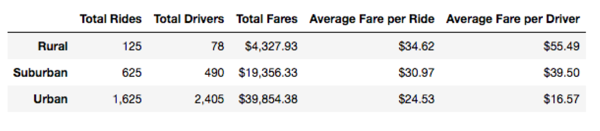
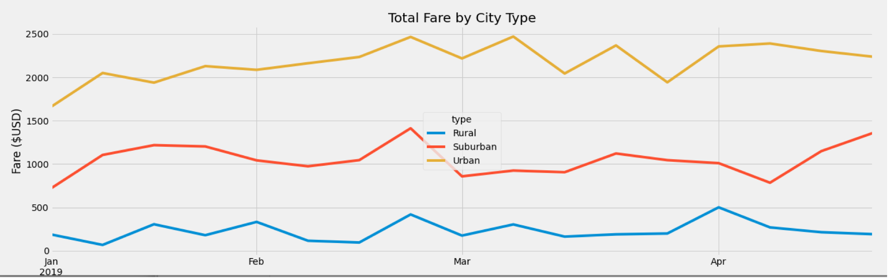

# PyBer_Analysis

## Overview 

The objective of the analysis is to create a summary of the ride-sharing data by city type as well as to create a multiple-line graph using python, pandas and matplotlib to display the total weekly fares for each city type and understand how the data differs by city type and how those differences can be used by decision-makers at PyBer in order to improve access to ride-sharing services and determine affordability for under serve neighborhoods.

---
## Results

The table below, shows a summary of the differences in ride-sharing data among the different city types.

The summary of the data provides the following observations: 
* There is a higher demand for rides in suburban and rural cities than urban cities compared to the total drivers available.
* Urban cities have a ratio of about 2 drivers per ride, (less rides compared to available drivers).
* The average fares per ride and per driver is higher in rural and suburban cities compared to the urban cities, due to the higher ride demand compared to available drivers. 
* Total fare revenue is higher in urban cities compared to suburban and rural cities, due to the total amount of rides (61% higher than suburban and 92% higher than rural). See weekly total fare by city plot.

---
## Summary

The recomendations to the CEO would be to increase the amount of drivers in rural and suburban cities in order to supply the ride demand in those cities therefore reduce the average fare per ride and driver.  

---
